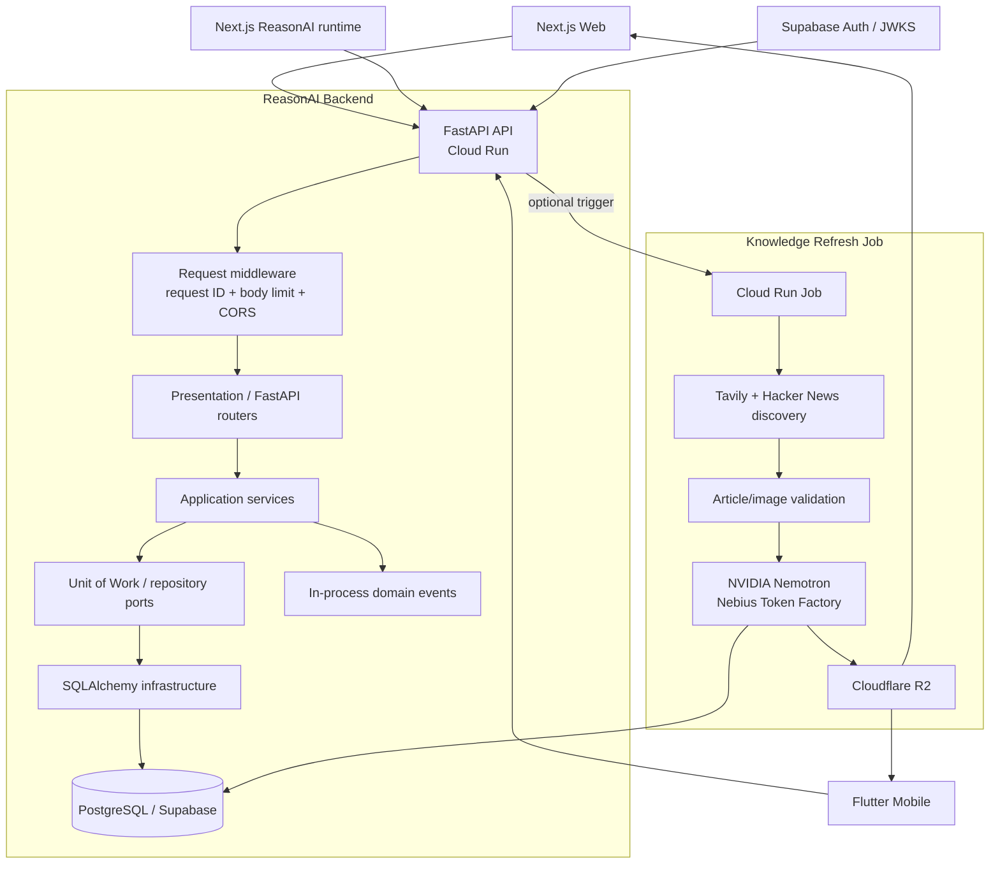

# ReasonAI Backend

ReasonAI Backend is the Python/FastAPI domain backend for the ReasonAI platform. It owns authenticated product data, learning state, DSA content, practice/revision workflows, persisted System Design diagrams, Knowledge Feed serving/personalization, offline synchronization, administrator workflows, and the asynchronous Knowledge refresh pipeline.

It is a **Python 3.12 modular monolith** built on FastAPI, SQLAlchemy 2, psycopg 3 and PostgreSQL. The production database is currently Supabase PostgreSQL, but runtime persistence uses standard PostgreSQL drivers and SQLAlchemy rather than the Supabase SDK or PostgREST.

A crucial architecture boundary is that this service is **not the primary interactive ReasonAI LLM runtime**. DSA and System Design agent orchestration, durable ReasonAI conversations, learner-memory extraction, streaming NDJSON generation and Tavily tool loops used by interactive chat run behind the Next.js web service. FastAPI remains the authoritative domain backend. The Knowledge refresh job is the exception: it performs offline discovery/enrichment with Tavily, Nemotron and R2 before prepared stories enter the online feed.

---

## What the backend owns

| Capability | Backend responsibility |
| --- | --- |
| Identity projection | Verify Supabase access tokens, resolve/create application profiles and roles |
| Catalog | Domains, categories, topics, searchable published content |
| DSA content | Published study-note documents, practice resources, taxonomy and progress projections |
| Learning | Progress, bookmarks, notes and activity events |
| Practice | Immutable practice attempts and initial review scheduling |
| Recall / Revise | Review cards, submissions, scheduling and immutable history |
| System Design persistence | Per-user diagram snapshots with optimistic revision control |
| Knowledge Feed | Prepared stories, deterministic ranking, preferences, viewer state and interaction events |
| Knowledge ingestion | Offline discovery → validation → Nemotron enrichment → R2 → PostgreSQL |
| Offline sync | Device registry, push mutations, incremental pull, full-resync snapshots and retention |
| Administration | Content authoring/publishing, user inspection, role administration and analytics |
| Search | PostgreSQL full-text search over published content |
| Platform concerns | health/readiness, body limits, request IDs, structured errors, DB instrumentation |

### Explicitly outside this service

The following currently live elsewhere:

- interactive DSA/System Design LangGraph execution
- ReasonAI NDJSON chat streaming
- server-owned ReasonAI conversation/run persistence
- cross-conversation DSA learner memory extraction/storage
- System Design realtime WebSocket room state
- Nemotron/Tavily execution for interactive ReasonAI turns
- web/mobile presentation state

This separation prevents the FastAPI domain backend from becoming coupled to one model provider or conversational runtime.

---

# 1. High-level architecture



### Runtime paths

There are deliberately two very different hot paths.

**Normal product request**

```text
Web / Mobile
   ↓ Bearer token
FastAPI route
   ↓
current-user resolution
   ↓
application service
   ↓
request-scoped Unit of Work
   ↓
PostgreSQL transaction/query
   ↓
Pydantic response
```

**Knowledge ingestion**

```text
Cloud Scheduler / user refresh request
   ↓
Cloud Run Job
   ↓
PostgreSQL advisory lock
   ↓
cleanup
   ↓
discovery
   ↓
content + image quality gates
   ↓
Nemotron structured enrichment
   ↓
R2 upload
   ↓
short DB transaction
   ↓
prepared story becomes eligible for feed
```

No model call belongs on the normal Knowledge Feed read path.

---

# 2. Architectural style: modular monolith

The backend is one deployable FastAPI process but internally split into bounded modules.

```text
src/recallstack/
├── main.py
├── health.py
├── composition/
├── modules/
│   ├── identity/
│   ├── catalog/
│   ├── content/
│   ├── learning/
│   ├── practice/
│   ├── recall/
│   ├── diagrams/
│   ├── knowledge/
│   ├── sync/
│   └── admin/
├── shared/
│   ├── auth/
│   ├── config/
│   ├── database/
│   ├── errors/
│   ├── events/
│   ├── logging/
│   └── observability/
└── commands/
```

Most feature modules follow the same direction:

```text
presentation
    ↓
application
    ↓
domain / ports
    ↓
infrastructure
```

The composition layer creates concrete SQLAlchemy unit-of-work implementations and injects them into application services during FastAPI lifespan startup.

### Why a modular monolith

At the current product stage, a modular monolith gives ReasonAI:

- one transactional PostgreSQL boundary for learning workflows
- no distributed-transaction problem between closely related learning domains
- simple Cloud Run deployment
- explicit module ownership without premature network boundaries
- independent future extraction paths because services already depend on ports/UoWs instead of route-local SQL

Separate services are used where the operational characteristics are genuinely different: the realtime Go server and the Knowledge refresh Cloud Run Job.

---

# 3. FastAPI composition and lifecycle

`create_app()` constructs the process-wide infrastructure during FastAPI lifespan startup.

```text
create_app
   ↓
load validated Settings
   ↓
configure structured logging
   ↓
FastAPI lifespan starts
   ├─ Database / SQLAlchemy engine
   ├─ shared HTTP client for JWKS
   ├─ IdentityService
   ├─ Catalog/Content services
   ├─ LearningService
   ├─ PracticeAttemptService
   ├─ RecallService
   ├─ SearchService
   ├─ SyncService
   ├─ DiagramService
   ├─ Admin services
   ├─ Knowledge services when enabled
   ├─ SupabaseJwtVerifier
   └─ ReadinessProbe
```

The process owns the SQLAlchemy engine and connection pool. Application sessions remain request/work-unit scoped.

At shutdown the app closes external HTTP clients and disposes the database engine.

### Router composition

All product routers are mounted under `/api/v1`; health endpoints live outside that prefix.

The Knowledge router is mounted only when `KNOWLEDGE_ENABLED=true`, so the code can be deployed before the Knowledge database contract/configuration is ready.

Production disables FastAPI `/docs`; development/test environments retain it.

---

# 4. Authentication and identity

Clients authenticate with a Supabase access token:

```http
Authorization: Bearer <supabase access token>
```

The backend does not trust a user/profile identifier supplied in JSON, query parameters or route data when ownership can be derived from authentication.

## JWT verification

`SupabaseJwtVerifier` performs server-side verification using Supabase JWKS.

It validates:

- supported signing algorithm (`RS256` or `ES256`)
- `kid`
- signature
- issuer
- audience
- `exp`
- `iat`
- `iss`
- `aud`
- `sub`

The `sub` is parsed as the authentication UUID.

Signing keys use a bounded in-process JWKS cache. Refresh is serialized with an async lock, preventing a burst of expired/missing-key requests from creating redundant JWKS refreshes.

### Identity projection

The authentication subject is mapped into the application's `profiles` model. Runtime repositories do not query Supabase `auth.users`.

The single vendor-managed schema relationship is:

```text
public.profiles.id → auth.users.id
```

Everything beyond that relationship is application-owned PostgreSQL state.

This means authorization logic uses ReasonAI application roles/profile state rather than trusting role claims invented by clients.

---

# 5. HTTP request lifecycle

Every HTTP request passes through shared middleware before the feature route.

```text
request
  ↓
CORS
  ↓
body-size limiter
  ↓
request context / request ID
  ↓
FastAPI dependency graph
  ↓
authentication / current profile
  ↓
feature route
  ↓
application service
  ↓
UoW / DB
  ↓
shared error mapping
  ↓
response + X-Request-ID
```

## Request IDs and trace context

`RequestContextMiddleware` accepts a bounded safe `X-Request-ID` or generates a UUID. The chosen ID is returned as:

```http
X-Request-ID: ...
```

A valid W3C `traceparent` trace ID is also extracted into request context. Request logs include request ID, trace ID, profile ID when known, method, route, status, error type and latency.

## Request body bound

`BodySizeLimitMiddleware` rejects oversized bodies before application code needs to materialize them. The default maximum is 1 MiB and can be configured up to 10 MiB.

Oversized requests return RFC7807-style `application/problem+json` with HTTP 413.

---

# 6. PostgreSQL and transaction architecture

ReasonAI uses SQLAlchemy 2 async sessions over psycopg 3.

The `Database` object owns one process-wide async engine. Sessions are created from an `async_sessionmaker` configured with:

```text
expire_on_commit = false
autoflush = false
```

The pool supports:

- pre-ping
- configurable pool size
- bounded overflow
- pool timeout
- connection recycle

`DATABASE_URL` accepts ordinary `postgresql://`/`postgres://` values and normalizes them to the psycopg SQLAlchemy dialect.

### Cloud Run connection budget

Maximum possible connections are approximately:

```text
(pool_size + max_overflow) × max Cloud Run instances
```

That upper bound must remain below the PostgreSQL provider limit. The example deployment starts conservatively at pool size 2 + overflow 3.

## Query instrumentation

SQLAlchemy engine events record query completion timing with request/trace context. Logs store operation type and duration, not raw query values as an application-level tracing feature.

## Unit of Work

Business services receive factories for concrete SQLAlchemy UoWs rather than opening global sessions.

A unit of work gives a workflow one explicit transaction boundary and lets online routes, sync adapters and importers reuse the same domain service without duplicating business rules.

This is especially important for:

- progress + activity + sync change allocation
- practice attempt + progress + review-card scheduling
- review submission + immutable history + new schedule
- content publication + taxonomy + search projection + catalog change
- sync mutation ledger + authoritative mutation + user cursor

---

# 7. Schema and data ownership

The Alembic migration chain is the repository source of truth.

The schema uses PostgreSQL features deliberately:

- UUIDs / `gen_random_uuid()`
- JSONB
- PostgreSQL enums
- `tsvector` + GIN search
- partial indexes
- regular-expression checks
- row-level security for selected contracts
- row locks / advisory locks where serialization is required

Core application areas include identity, catalog/taxonomy, content, learning, practice, recall, sync, diagrams and Knowledge.

### Append-only records

The application contract treats several tables as immutable/append-only, including practice attempts, review history, activity events and change logs. Runtime privileges should reflect that contract even though PostgreSQL has no portable single declarative "append only" constraint.

---

# 8. Catalog and published content

Catalog data models the stable learning taxonomy and published content surface.

### Category dashboard

Category dashboard results are intentionally unpaginated because the taxonomy itself is bounded and administrator curated.

Semantics:

- only direct assignments count
- descendants are not recursively rolled into parents
- missing progress and explicit `new` both mean "not started"
- progress percentage is based on published, non-archived directly assigned items that moved beyond `new`

### Category content

Content lists are paginated because content volume is unbounded relative to category count.

Supported dimensions include:

```text
type
difficulty
status
topic
search
```

Supported sort dimensions include:

```text
sort_order
title
difficulty
updated_at
```

Only the stable item's current published version participates in learner-facing reads.

---

# 9. Published DSA study-note read path

A study-note request resolves the current published version, learner projection and active practice resource.

```text
GET /api/v1/content/:slug
       ↓
verified profile
       ↓
current published content version
       ↓
ordered document blocks
       ↓
current taxonomy + practice resource
       ↓
private learner state
       ↓
content_opened activity event
       ↓
response
```

The response uses a weak ETag based on stable content identity and published version, but currently remains `private, no-cache` because progress/bookmark/review information can change independently of the document version.

A `304` based solely on the document version would therefore risk serving stale private learner state, so conditional 304 behavior is deliberately not enabled yet.

---

# 10. Learning state

The Learning module owns learner progress, bookmarks and notes.

## Progress

New progress starts at:

```text
row_version = 0
```

Subsequent writes use optimistic concurrency. A stale row version returns `409 Conflict` rather than silently overwriting newer state.

## Bookmarks

Bookmark PUT/DELETE is idempotent. A no-op bookmark mutation does not allocate a sync cursor.

## Notes

Notes support optimistic row-version checking and soft deletion. Existing historical learner records survive content archival, but new writes require active/published content where applicable.

### Transactional sync projection

Direct online learning writes allocate their user-sync change in the same transaction as the authoritative entity/activity update. The sync adapter can reuse that cursor instead of generating a second logical change.

---

# 11. Practice attempts

Practice attempts are immutable command/event records.

A client supplies a generated `attempt_event_id`.

```text
POST practice attempt
   ↓
deduplicate attempt_event_id
   ↓
validate active content
   ↓
apply monotonic learning-state policy
   ↓
run initial review scheduler
   ↓
persist immutable attempt/result snapshot
   ↓
commit progress + review effects + activity + sync projection
```

Exact retries return the original persisted result rather than reconstructing it from today's mutable progress/review state.

The current v1 initial scheduler is deterministic and behind an application interface so a future FSRS-style scheduler can replace it without changing route/storage contracts.

Practice cannot implicitly downgrade a more advanced state such as `mastered`.

---

# 12. Recall / Revise

Review cards are server authoritative.

A review submission includes:

- client-generated `review_event_id`
- expected row version
- learner rating
- review timestamp

A successful submission transaction:

```text
lock/check current review card
   ↓
deduplicate review_event_id
   ↓
validate expected row version
   ↓
calculate next schedule
   ↓
update current card
   ↓
append immutable review history
   ↓
record scheduler name/version + before/after schedule
   ↓
activity + sync projection
   ↓
commit
```

The mobile/web Revise experience can therefore handle conflicts explicitly instead of allowing two devices to unknowingly overwrite scheduling state.

---

# 13. Persistent System Design diagrams

The backend owns durable user diagram snapshots; it does **not** own live room presence/operation transport.

Current diagram API supports:

```text
GET    /api/v1/diagrams
POST   /api/v1/diagrams
GET    /api/v1/diagrams/:id
PUT    /api/v1/diagrams/:id
PATCH  /api/v1/diagrams/:id
POST   /api/v1/diagrams/:id/duplicate
DELETE /api/v1/diagrams/:id
```

Every operation is scoped to the authenticated profile.

### Diagram document invariants

The persisted JSON document must agree with the resource:

```text
document_json.id == diagram resource UUID
document_json.schemaVersion == schema_version
```

### Optimistic revision control

Diagram updates/renames carry `expected_revision`.

```text
load owned diagram FOR UPDATE
       ↓
revision == expected_revision ?
   ├─ no → 409 diagram-revision-conflict
   └─ yes
       ↓
    write snapshot
       ↓
    revision += 1
       ↓
    commit
```

This is distinct from WebSocket realtime collaboration. Realtime Go room state handles ordered live operations; FastAPI stores durable snapshot documents.

---

# 14. Knowledge Feed online architecture

Knowledge is an optional backend module controlled by `KNOWLEDGE_ENABLED`.

Online API containers need a cursor secret but do **not** need Tavily, Nebius or R2 write credentials to serve already-prepared stories.

Key routes:

```text
GET   /api/v1/knowledge/feed
GET   /api/v1/knowledge/stories/:storyId
GET   /api/v1/knowledge/preferences
PATCH /api/v1/knowledge/preferences
POST  /api/v1/knowledge/events/batch
POST  /api/v1/knowledge/refresh-runs
GET   /api/v1/knowledge/refresh-runs/:runId
```

Story responses expose public CDN image URLs; internal R2 keys never need to reach browsers/mobile clients.

---

# 15. Knowledge ranking

The online feed uses deterministic PostgreSQL-backed ranking rather than invoking an LLM for every feed view.

Current base weights:

```text
importance                0.40
story quality             0.20
source quality            0.10
max explicit topic match  0.15
source preference         0.05
7-day freshness           0.10
```

An optional user interest prompt is stored with preferences. Up to 12 distinct terms contribute a bounded PostgreSQL full-text match over title, summary and why-it-matters fields inside the existing feed query.

### What "learning" means on this path today

The backend currently persists explicit preferences and behavioral events, but the hot-path ranking policy is deterministic. It does **not** currently train a model or compute an automatically learned user-affinity vector from behavior.

That distinction is intentional:

```text
CURRENT
explicit topic/source preferences
+ interest prompt terms
+ deterministic quality/freshness ranking
+ persisted behavior/state

NOT YET
behavior-trained affinity model
embedding/vector recommender
LLM reranker per request
model-weight self-training
```

The stored event history creates a foundation for future personalization without misrepresenting the current implementation as autonomous self-training.

---

# 16. Knowledge cursor pagination

Knowledge Feed does not use OFFSET pagination.

Cursors are:

- HMAC signed
- URL safe
- bounded to 2048 characters
- profile scoped
- topic/source scoped
- valid for one hour
- invalidated by relevant preference/source-registry changes

A cursor carries a ranking-session anchor plus the `(score, published_at, story_id)` ordering tuple.

The anchor prevents newly discovered stories from jumping into the middle of an existing scroll session; a fresh feed session can see them.

Secret rotation intentionally invalidates old pagination cursors.

---

# 17. Knowledge interaction state and events

Supported interaction events include:

```text
VIEW
OPEN
SAVE
UNSAVE
HIDE
UNHIDE
SHARE
ASK_REASONAI
```

Every event carries:

```text
eventId
storyId
type
occurredAt
```

Batches contain 1–100 events and commit in one transaction.

### Idempotency and out-of-order protection

`eventId` is the retry identity. Reusing it with changed data or another profile is a conflict; an exact retry is accepted as a no-op.

For state families such as:

```text
SAVE ↔ UNSAVE
HIDE ↔ UNHIDE
```

the latest `(occurred_at, event_id)` controls the projected state. A delayed offline batch therefore cannot undo a newer user action.

Per-profile PostgreSQL transaction locking serializes event projection and preference updates.

---

# 18. Knowledge refresh pipeline

Knowledge generation is a **separate job**, not work performed by feed requests.

```mermaid
flowchart LR
    LOCK[Advisory lock] --> CLEAN[Cleanup expired rows/images]
    CLEAN --> DISC[Discover\nTavily + HN]
    DISC --> DEDUPE[Canonicalize + dedupe]
    DEDUPE --> ARTICLE[Fetch metadata/content]
    ARTICLE --> GATE[Recency + technical gates]
    GATE --> IMAGE[Download + validate image]
    IMAGE --> MODEL[Nemotron structured enrichment]
    MODEL --> R2[Upload WebP to R2]
    R2 --> TX[Short DB transaction\nstory + topics]
```



### Execution lock

The refresh job obtains a PostgreSQL session advisory lock on a dedicated non-pooled connection. Overlapping scheduled/user-requested executions therefore do not duplicate paid discovery/enrichment work.

Transaction pooling is incompatible with this lock behavior; direct/session-pooler connectivity is required for the job.

### Provider discovery

Current discovery sources include:

- Tavily news/web discovery
- official Hacker News API

Provider adapters implement a discovery port. Adding another provider should not require rewriting orchestration.

### Quality gates before paid model work

Candidates are canonicalized/deduplicated, fetched, checked for technical relevance/recency and required to have a valid image before Nemotron enrichment.

This ordering deliberately avoids spending inference tokens on stories that cannot be displayed.

### Structured model enrichment

Nemotron returns structured story fields including a stable broad category plus specific open-vocabulary topics.

Canonical broad categories are:

```text
ai
agents
architecture
cloud
research
security
data
developer-tools
```

### Bounded concurrency

Discovery, enrichment, model calls, image processing and R2 operations have independent configurable concurrency limits. The job creates bounded worker tasks rather than unbounded fan-out.

Transient 429/5xx/network/timeout failures use bounded retries. Malformed structured model output and nonretryable HTTP failures fail that candidate rather than blindly repeating work.

One failed candidate does not discard successful siblings.

---

# 19. Image and R2 pipeline

FastAPI never proxies Knowledge images.

The job:

1. validates public external destinations and redirects
2. bounds downloaded bytes
3. validates image type/dimensions/pixel count
4. rejects animations/unsupported or unsafe inputs
5. converts the image to WebP off the event loop
6. uploads to Cloudflare R2
7. stores image metadata/key in PostgreSQL
8. exposes only the public CDN URL through the API

Current generated variant fits within `1080×1350`, uses WebP quality 82 and is capped at 1 MiB. Source aspect ratio is retained.

R2 object keys are deterministic from canonical URLs:

```text
shorts/YYYY/MM/DD/<canonical-url-sha256>.webp
```

Failed DB persistence triggers best-effort cleanup; deterministic keys also make retries safer.

### Seven-day retention

Knowledge story retention is fixed at seven days.

Every read still enforces freshness and active state even if cleanup has temporarily failed. Cleanup deletes R2 objects in bounded batches and only then removes the corresponding expired DB rows whose storage deletion succeeded.

---

# 20. User-requested Knowledge refresh

The API can optionally trigger the existing Cloud Run Job.

Required settings are an all-or-nothing tuple:

```text
KNOWLEDGE_REFRESH_JOB_PROJECT
KNOWLEDGE_REFRESH_JOB_REGION
KNOWLEDGE_REFRESH_JOB_NAME
```

Any authenticated user may request a refresh, but requests share one cooldown (default 30 minutes). A concurrent/recent request returns the existing run rather than launching another paid job.

The API stores refresh-run state before invoking Cloud Run. Job provider secrets remain on the Job environment; the API service does not need Tavily/Nebius/R2 credentials merely to request execution.

---

# 21. Offline synchronization architecture

The backend contains a substantial offline-sync protocol even though the current Flutter UI only uses a subset of it today.

## Devices

Mutations belong to a registered, active device owned by the authenticated profile. User identity is never accepted from a mutation payload.

## Push mutations

Supported offline mutation families include learning, bookmarks, private notes, practice attempts and review submissions.

A client provides a `mutation_id`. The server calculates a canonical request hash over the device/entity/operation/base version/payload.

```text
mutation_id unseen
   ↓
validate device ownership
   ↓
run same domain service used by online route
   ↓
allocate per-user cursor
   ↓
persist mutation ledger + result + change row
   ↓
commit once
```

If the same `mutation_id` returns with identical canonical content, the stored original result is replayed. Reusing the ID with changed content is a conflict.

Mutation outcomes are bounded to:

```text
applied
duplicate
rejected
conflict
```

Batch sync uses one transaction per mutation. A business-rule rejection therefore does not roll back valid siblings.

## Incremental pull

User and catalog change feeds use independent monotonic cursors. Pull feeds are bounded and device-aware because retention state is per device.

## Retention and compaction

Default retention is 30 days.

Compaction detects a device that has fallen behind soon-to-be-deleted changes and marks it for full resync before deleting history.

Run the compactor as a scheduled job:

```bash
uv run python -m recallstack.commands.compact_sync
```

---

# 22. Full-resync protocol

When an incremental response says:

```json
{"full_resync_required": true}
```

a client must not simply reset its cursor and continue.

Correct lifecycle:

```text
POST .../full-resync with device_id
   ↓
server reads rows + cursor in one REPEATABLE READ snapshot
   ↓
persist immutable snapshot (~30 minute lifetime)
   ↓
client atomically stores full response + snapshot_cursor
   ↓
client ACKs snapshot_id + device_id + exact snapshot_cursor
   ↓
server clears full_resync_required
   ↓
client resumes incremental pull after snapshot_cursor
```

Downloading alone never advances device state.

ACK is ownership-scoped and idempotent. Expired snapshots return 410; unknown/cross-owner IDs return 404.

Catalog full snapshots include ordered category assignments, current published document blocks and active primary practice-resource information needed by an offline client.

---

# 23. Search

Published learning content uses PostgreSQL full-text search (`tsvector`/GIN) rather than an external search service.

Publication refreshes the stable item's searchable document in the same application workflow that switches the published version.

At current scale this keeps search consistent with transactional publication without operating Elasticsearch/Solr/vector infrastructure.

---

# 24. Admin content workflow

The content-authoring lifecycle is:

```text
draft
  ↓ submit review
in_review
  ├─ return to draft
  └─ publish
       ↓
published
```

Content editors/admins may create and edit drafts, taxonomy and practice-resource mappings. Only administrators may publish, return an in-review version or archive content.

### Published immutability

Published versions and their block composition are immutable. Editing published content creates/clones a new draft rather than mutating the historical published document.

### Version-owned taxonomy

Category/topic assignments belong to content versions. Draft taxonomy remains invisible until publication. Publishing atomically switches document and taxonomy together.

### Publish transaction

A successful publication:

```text
lock/check in-review version
   ↓
validate publish invariants
   ↓
set reviewer/publisher metadata
   ↓
advance current-published-version pointer
   ↓
make version taxonomy public
   ↓
refresh search projection
   ↓
append workflow history
   ↓
emit catalog change
   ↓
commit once
```

Draft updates and workflow transitions use `expected_row_version`; stale writers receive 409.

---

# 25. Practice resource concurrency

Practice resources are stable item-level entities, not version-owned document blocks.

Replacement is an atomic set operation with `expected_revision`.

Clients:

- keep IDs for resources they are updating
- omit active resources they intend to archive
- send the expected resource-set revision

Historical resources are archived, not hard deleted. URLs must be HTTPS, and the server normalizes/hashes them.

---

# 26. Admin users, roles and privacy boundaries

Admin user inspection exposes operational application data but not authentication secrets.

Responses do not query/return:

- password material
- access tokens
- refresh tokens
- Supabase auth credentials
- raw `auth.*` records

Role grants are an audited history. Grant/revoke operations lock the target profile, record actor/timestamps and never delete prior grant rows.

Repeated requests are idempotent. PostgreSQL serialization prevents revoking the final active administrator; that operation returns 409.

---

# 27. DSA workbook import

The production workbook importer runs through the same admin application services used by API-based publishing.

Dry run is the default and makes no writes:

```bash
uv run python -m recallstack.commands.import_dsa_workbook \
  "../data/DS Algo/Ultimate DSA.xlsx" \
  --report ./dsa-import-report.json
```

Apply mode requires an explicit active administrator profile:

```bash
uv run python -m recallstack.commands.import_dsa_workbook \
  "../data/DS Algo/Ultimate DSA.xlsx" \
  --apply \
  --actor-profile-id PROFILE_UUID \
  --report ./dsa-import-applied.json
```

Each workbook row uses one outer PostgreSQL transaction, so document, taxonomy, resources, publication workflow, audit/search and catalog changes either complete together or roll back together.

Stable source-index slugs/fingerprints make retries resumable without duplicating already published problems.

---

# 28. State ownership matrix

| State | System of record | Notes |
| --- | --- | --- |
| Supabase authentication session | Supabase Auth | Backend verifies token; does not own credentials |
| Application profile / roles | PostgreSQL | Identity/authorization projection |
| Published DSA/content | PostgreSQL | Versioned and admin-controlled |
| Progress/bookmarks/notes | PostgreSQL | User-owned, sync-capable |
| Practice attempts | PostgreSQL | Immutable/idempotent |
| Review cards/history | PostgreSQL | Current card + immutable submission history |
| System Design diagram snapshots | PostgreSQL | Owner scoped + revision controlled |
| Live System Design room state | Go realtime service memory | Not stored here during the live room protocol |
| ReasonAI DSA/System Design conversations | Web ReasonAI persistence in Supabase/Postgres | Owned by Next.js ReasonAI runtime |
| ReasonAI learner memory | Web ReasonAI persistence | Not FastAPI learning progress |
| Knowledge stories/topics | PostgreSQL | Generated offline, served online |
| Knowledge image bytes | Cloudflare R2 | Public CDN URL returned to clients |
| Knowledge preferences/events/viewer state | PostgreSQL | Deterministic ranking inputs / product state |
| Offline device state / mutation ledger | PostgreSQL | Retention-aware sync protocol |
| Mobile local drafts/saved projection | device SQLite | Not server authoritative |

---

# 29. Memory and "self-learning" boundaries

ReasonAI has multiple persistent learning/memory mechanisms across services.

The **FastAPI backend** owns factual product-learning state:

```text
progress
practice attempts
review schedule/history
notes
bookmarks
Knowledge interactions
Knowledge explicit preferences
```

The **Next.js ReasonAI runtime** owns conversational/adaptive AI memory:

```text
bounded DSA conversation state
bounded System Design conversation state
cross-conversation DSA learner traits when enabled
ReasonAI run/transcript persistence
```

Neither of these is the same as training Nemotron model weights.

Current ReasonAI "self-learning" should therefore be described as **application-level adaptation from durable state**, not autonomous foundation-model retraining.

---

# 30. Concurrency and idempotency patterns

Different write paths use the mechanism appropriate to their failure mode.

| Workflow | Protection |
| --- | --- |
| Progress / note update | expected `row_version` |
| Review submission | `review_event_id` + expected row version |
| Practice attempt | immutable `attempt_event_id` |
| Diagram save | expected diagram revision + row lock |
| Practice-resource replace | expected resource-set revision |
| Admin content version | expected version row + locks/CAS |
| Feed event | `eventId` + ordering tuple |
| Offline sync push | `mutation_id` + canonical request hash |
| Knowledge refresh | PostgreSQL advisory lock + cooldown state |
| Final-admin revoke | serialized PostgreSQL role mutation |

The goal is not merely "retry requests". It is to ensure that retries and concurrent clients cannot silently transform one user action into a different domain result.

---

# 31. Error contract

Application/domain failures are converted by shared error handlers instead of route-specific ad-hoc JSON.

Important semantic status codes include:

```text
400 malformed/invalid command where appropriate
401 invalid/expired authentication
403 authenticated but unauthorized
404 inaccessible/not-found resource
409 optimistic-concurrency/idempotency/business conflict
410 expired full-resync snapshot
413 request too large
422 structured validation/invariant error
503 unavailable dependency/readiness state
```

Ownership-scoped `404` responses are used where returning another user's resource existence would leak information.

---

# 32. Health and readiness

Endpoints:

```text
GET /health/live
GET /health/ready
```

Liveness proves that the process can answer.

Readiness performs a database `SELECT 1`. The result is cached briefly and guarded by a lock so a high-frequency probe does not create a database query storm.

A failed database check returns HTTP 503 readiness without declaring the process itself dead.

---

# 33. Observability

Current backend observability includes:

- structured request-completion logs
- stable/generated request IDs
- W3C trace ID extraction
- authenticated profile context in logs
- SQL operation timing
- latency/status/error categorization
- Knowledge provider outcome categorization
- health/readiness endpoints

`OTEL_ENABLED` exists as a feature boundary; a production OpenTelemetry exporter/collector is not yet hard-wired.

LangSmith is used in AI-oriented surfaces/job environments where configured, but it is not a replacement for backend request/database telemetry.

### Sensitive-data rule

Do not log bearer tokens, provider secrets, remote provider response bodies containing secrets, database passwords or other credential material.

---

# 34. Caching policy

Redis / Memorystore is intentionally **not required** at current scale.

PostgreSQL is the source of truth. The architecture adds a cache only after measurements demonstrate a real hot-path latency/load problem that justifies invalidation and operational complexity.

Existing in-process caches are narrowly scoped, such as:

- JWKS signing keys
- readiness result

Knowledge Feed pagination/ranking is DB-driven and does not need a model/cache service on every request.

---

# 35. Security boundaries

Backend security depends on several layers rather than trusting the UI.

### Authentication

- JWT signature/issuer/audience validation
- current profile derived server-side
- user IDs ignored from client payloads for owned operations

### Authorization

- role checks at backend boundaries
- owner-scoped data access
- final-admin protection

### Input/network safety

- Pydantic validation
- request body size limit
- HTTPS-only external content URLs where required
- hardened Knowledge image fetch/redirect validation
- strict configuration validation

### Persistence safety

- optimistic concurrency
- idempotency ledgers/event IDs
- transactional units of work
- immutable historical rows
- least-privilege runtime credentials recommended

### CORS

`CORS_ALLOWED_ORIGINS` is configurable. Wildcard origins with credential cookies disabled are acceptable for early controlled bearer-token clients, but production browser deployments should use exact known origins.

---

# 36. Core API surface

This is a grouped overview; FastAPI/OpenAPI remains the exact machine-readable contract.

### Health

```text
GET /health/live
GET /health/ready
```

### Identity

```text
GET   /api/v1/me
PATCH /api/v1/me
```

### Catalog/content/search

```text
GET /api/v1/domains/:domainSlug/categories
GET /api/v1/categories/:categoryId/content
GET /api/v1/content/:slug
GET /api/v1/search
```

### Learning

```text
GET        /api/v1/me/progress
GET|PUT    /api/v1/me/progress/:contentId
GET        /api/v1/me/bookmarks
PUT|DELETE /api/v1/me/bookmarks/:contentId
GET        /api/v1/me/notes
GET        /api/v1/me/content/:contentId/notes
POST       /api/v1/me/notes
PATCH|DELETE /api/v1/me/notes/:noteId
```

### Practice / Recall

```text
POST /api/v1/practice/attempts
GET  /api/v1/me/reviews
GET  /api/v1/me/reviews/due
POST /api/v1/me/reviews/:cardId/submit
GET  /api/v1/me/reviews/history
```

### Diagrams

```text
GET|POST /api/v1/diagrams
GET|PUT|PATCH|DELETE /api/v1/diagrams/:diagramId
POST /api/v1/diagrams/:diagramId/duplicate
```

### Knowledge

```text
GET   /api/v1/knowledge/feed
GET   /api/v1/knowledge/stories/:storyId
GET   /api/v1/knowledge/preferences
PATCH /api/v1/knowledge/preferences
POST  /api/v1/knowledge/events/batch
GET|POST /api/v1/knowledge/refresh-runs
GET   /api/v1/knowledge/refresh-runs/:runId
```

### Offline sync

```text
POST /api/v1/devices/register
GET  /api/v1/me/devices
POST /api/v1/devices/:deviceId/revoke
POST /api/v1/sync/mutations
POST /api/v1/sync/mutations/batch
GET  /api/v1/sync/user
GET  /api/v1/sync/catalog/:domainId
POST /api/v1/sync/user/full-resync
POST /api/v1/sync/catalog/:domainId/full-resync
... matching full-resync ACK routes
```

### Administration

Admin APIs cover:

- content creation/versioning/document editing
- practice-resource replacement
- submit/return/publish/archive workflow
- users/progress/practice/reviews
- role grant/revoke
- analytics/audit-oriented views

The backend remains the final authorization boundary even when the web UI hides administrative navigation.

---

# 37. Local development

Prerequisites:

- Python 3.12
- `uv`
- Docker

```bash
cd backend
cp .env.example .env
docker compose up -d postgres
uv sync --frozen
uv run alembic upgrade head
uv run python -m recallstack.commands.seed
uv run uvicorn recallstack.main:app --reload --port 8080
```

PowerShell:

```powershell
Copy-Item .env.example .env
```

Compose provides a minimal local `auth.users` principal table so the production-compatible profile foreign key can be migrated without running Supabase locally.

If an old local volume predates this setup:

```bash
docker compose down -v
docker compose up -d postgres
```

Never commit `.env`.

---

# 38. Configuration

Core runtime variables:

```text
APP_ENV
LOG_LEVEL
PORT
DATABASE_URL
DATABASE_POOL_SIZE
DATABASE_MAX_OVERFLOW
DATABASE_POOL_TIMEOUT
DATABASE_POOL_RECYCLE
DATABASE_POOL_PRE_PING
SUPABASE_PROJECT_URL
SUPABASE_JWT_ISSUER
SUPABASE_JWT_AUDIENCE
SUPABASE_JWKS_URL
JWKS_CACHE_SECONDS
REQUEST_BODY_MAX_BYTES
CORS_ALLOWED_ORIGINS
READINESS_CACHE_SECONDS
SYNC_RETENTION_DAYS
OTEL_ENABLED
```

Knowledge API variables:

```text
KNOWLEDGE_ENABLED
KNOWLEDGE_CURSOR_SECRET
KNOWLEDGE_FEED_DEFAULT_LIMIT
KNOWLEDGE_FEED_MAX_LIMIT
KNOWLEDGE_REFRESH_JOB_PROJECT
KNOWLEDGE_REFRESH_JOB_REGION
KNOWLEDGE_REFRESH_JOB_NAME
KNOWLEDGE_REFRESH_COOLDOWN_MINUTES
```

Knowledge Job-only/provider variables include:

```text
KNOWLEDGE_BATCH_SIZE
KNOWLEDGE_DISCOVERY_TOPICS
KNOWLEDGE_*_CONCURRENCY
KNOWLEDGE_PROVIDER_TIMEOUT
KNOWLEDGE_PROVIDER_RETRIES
KNOWLEDGE_IMAGE_MAX_BYTES
TAVILY_API_KEY
NEBIUS_API_KEY
KNOWLEDGE_MODEL
KNOWLEDGE_MODEL_BASE_URL
R2_ACCOUNT_ID
R2_ACCESS_KEY_ID
R2_SECRET_ACCESS_KEY
R2_BUCKET
R2_PUBLIC_BASE_URL
R2_ENDPOINT_URL
```

`KNOWLEDGE_CURSOR_SECRET` must be at least 32 characters when Knowledge is enabled and must be identical across serving API instances.

---

# 39. Verification and CI quality gates

Run the complete backend verification locally:

```bash
uv run ruff format --check .
uv run ruff check .
uv run mypy
uv run pytest
uv export --frozen --no-dev --no-emit-project -o .audit-requirements.txt
uv run pip-audit -r .audit-requirements.txt
```

Real PostgreSQL integration/schema tests use Testcontainers:

```bash
RUN_INTEGRATION_TESTS=1 uv run pytest
```

PowerShell:

```powershell
$env:RUN_INTEGRATION_TESTS='1'
uv run pytest
```

Knowledge deployed-contract verification is separately opt-in so ordinary tests never call external providers.

---

# 40. Docker and Cloud Run

Build/run locally:

```bash
docker build -t reasonai-backend .
docker run --rm -p 8080:8080 --env-file .env reasonai-backend
```

The production image:

- uses Python 3.12 slim
- installs frozen dependencies with `uv`
- runs as non-root UID/GID 10001
- honors Cloud Run `PORT`
- uses `exec` so Uvicorn receives termination signals
- disables arbitrary proxy-header trust

The API entrypoint is effectively:

```bash
uvicorn recallstack.main:app \
  --host 0.0.0.0 \
  --port $PORT \
  --no-proxy-headers
```

### Database migrations

Run:

```bash
uv run alembic upgrade head
```

as a separate controlled release/migration job with schema-owner credentials.

Do **not** run migrations concurrently from every serving API instance.

Runtime database credentials should be least privileged and separate from the migration/schema-owner role.

---

# 41. Knowledge Cloud Run Job

The same application image can run the offline Knowledge entrypoint:

```bash
python -m recallstack.modules.knowledge.jobs.refresh --limit 20
```

Useful development modes:

```bash
uv run python -m recallstack.modules.knowledge.jobs.refresh --dry-run --limit 5
uv run python -m recallstack.modules.knowledge.jobs.refresh --dry-run --limit 5 --source tavily
uv run python -m recallstack.modules.knowledge.jobs.refresh --limit 5
```

Dry run performs live read/discovery/enrichment/image validation but does not write the DB, upload/delete R2 objects or mutate cleanup state.

The production Job should use one Cloud Run task per execution; the PostgreSQL advisory lock remains a second line of overlap protection.

---

# 42. Important implementation documents

Deep subsystem contracts remain in focused documents:

- [`docs/schema.md`](docs/schema.md) — PostgreSQL schema decisions and transactional invariants
- [`docs/knowledge-shorts.md`](docs/knowledge-shorts.md) — Knowledge API/job/ranking/retention pipeline
- [`docs/knowledge-shorts-contract.md`](docs/knowledge-shorts-contract.md) — exact Knowledge persistence contract
- [`docs/admin-panel-backend.md`](docs/admin-panel-backend.md) — administration/analytics contract
- [`docs/dsa-workbook-import.md`](docs/dsa-workbook-import.md) — workbook import mapping and rollback

The README is the system-level backend map; these documents are the subsystem source of truth when implementation-level detail is needed.

---

# 43. Current vs future architecture

| Area | Current | Future direction / intentionally deferred |
| --- | --- | --- |
| Backend shape | FastAPI modular monolith | Split only when operational boundaries justify it |
| Database | PostgreSQL / Supabase | Remain provider-portable where practical |
| Search | PostgreSQL FTS | External search only if measured scale requires it |
| Cache | No Redis dependency | Add only after measured hot-path need |
| DSA scheduling | Deterministic scheduler interface | FSRS-compatible replacement possible |
| Knowledge ranking | Deterministic + explicit preferences + interest terms | Learned behavioral affinity can be added later |
| Knowledge AI | Offline Nemotron enrichment | No per-feed LLM call planned on hot path |
| ReasonAI agent runtime | Next.js/LangGraph | Keep separate from domain API unless boundary changes materially |
| Realtime | Separate Go service | Durable room persistence/multi-instance evolution outside FastAPI hot path |
| Observability | Request/DB logs + request/trace IDs | Full OpenTelemetry exporter/SLO stack |
| Mobile sync | Server protocol implemented | Broader Flutter offline-sync wiring can consume it progressively |

---

## Design principle

The backend should remain the **authoritative, deterministic domain system** for ReasonAI. AI may propose, summarize, enrich and personalize, but durable learner state, content publication, permissions, revision control, sync semantics and product invariants must remain explicit, testable server-side rules.
