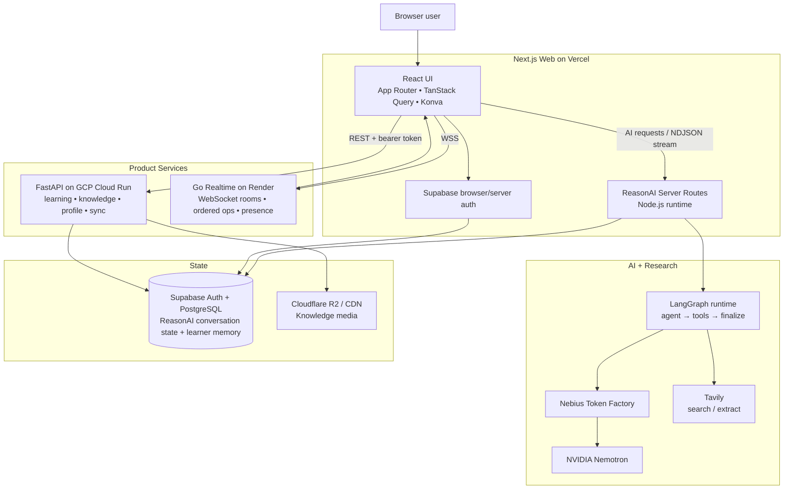
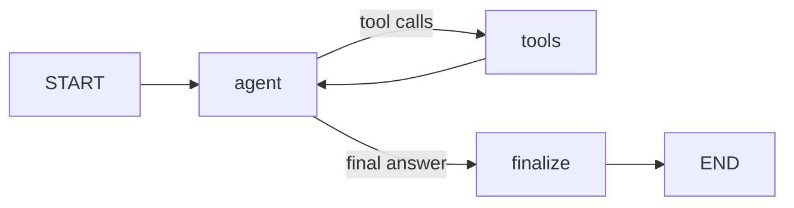
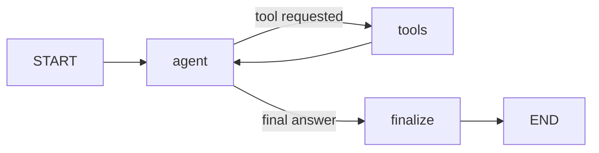

# ReasonAI Web

ReasonAI Web is the primary interactive client and AI orchestration boundary for ReasonAI. It combines a Next.js App Router application, React/Konva visual workspaces, authenticated FastAPI product APIs, LangGraph-based ReasonAI runtimes, durable AI conversation state, Tavily-grounded research, Nebius-hosted NVIDIA Nemotron inference, and the Go realtime collaboration service.

The web application is intentionally more than a frontend. It owns the browser experience **and** a small server-side BFF/orchestration layer for AI workloads that must never expose provider credentials to the browser.

**Live product:** [https://reasonai.tech](https://reasonai.tech)

---

## 1. What the web application owns

ReasonAI Web currently owns these product surfaces:

- **Knowledge Feed** — personalized technical stories, detail view, interaction events, feed preferences, on-demand refresh and Ask ReasonAI.
- **DSA Learning Workspace** — source-aware tutoring, progressive hints, review, complexity analysis, web research, visual walkthroughs, durable tutoring state and optional learner memory.
- **System Design Workspace** — Konva architecture canvas, AI chat/review/fix/eagle modes, web research, semantic architecture analysis, reviewable canvas proposals and Live Share.
- **Authentication and session UX** — Supabase browser/server integration, route protection and bounded refresh/retry behavior.
- **Admin UI** — content/user administration and System Design administration.
- **ReasonAI server routes** — protected Node.js routes that perform model/tool orchestration, streaming, durable conversation lifecycle handling and telemetry.

The web package does **not** own the core learning database, Knowledge Feed ranking database queries, offline-sync engine or realtime room server. Those remain in the FastAPI backend and Go realtime service.

---

## 2. Runtime topology



The most important boundary is:

```text
Browser
  ├─ public configuration only
  ├─ authenticated FastAPI calls
  ├─ authenticated ReasonAI calls
  └─ realtime WebSocket connection

Next.js server
  ├─ NEBIUS_API_KEY
  ├─ TAVILY_API_KEY
  ├─ LangGraph execution
  ├─ tool execution
  ├─ durable ReasonAI lifecycle
  └─ optional LangSmith tracing
```

Provider credentials must never cross into client bundles.

---

## 3. Technology stack

| Layer | Technology | Responsibility |
| --- | --- | --- |
| Application | Next.js 16 App Router | routes, layouts, server handlers, deployment boundary |
| UI | React 19 + TypeScript | application and interaction layer |
| Canvas | Konva + react-konva | System Design diagrams, overlays and interaction |
| Remote state | TanStack Query | backend query/mutation state and cache lifecycle |
| API transport | openapi-fetch | generated FastAPI contract integration |
| Authentication | Supabase SSR + supabase-js | browser sessions, server verification, OAuth |
| AI graph | LangGraph | stateful DSA/System Design agent execution |
| Model | NVIDIA Nemotron via Nebius Token Factory | tutoring, reasoning, summarization, structured tool calls |
| Research | Tavily | bounded public search/extraction and grounding |
| Validation | Zod | input, state, tool and structured-output contracts |
| Markdown | react-markdown + remark-gfm | safe AI answer rendering |
| Observability | LangSmith + structured application logs | optional ReasonAI traces and runtime diagnostics |
| Tests | Playwright | state/provider tests and browser E2E |

Node.js **22+** is required by the package.

---

## 4. Repository structure

```text
web/
├── src/
│   ├── app/
│   │   ├── (app)/                  authenticated product routes
│   │   ├── (admin)/                administrator routes
│   │   ├── (auth)/                 auth pages
│   │   ├── api/reasonai/           server-side ReasonAI entrypoints
│   │   ├── auth/                   auth callbacks
│   │   └── system-design/          System Design and live guest routes
│   │
│   ├── features/
│   │   ├── auth/
│   │   ├── feed/
│   │   ├── dsa/
│   │   ├── system-design/
│   │   └── ...                     domain-owned UI/data modules
│   │
│   ├── components/
│   │   ├── layout/
│   │   ├── reasonai/
│   │   └── ui/
│   │
│   └── lib/
│       ├── api/                     generated API transport/types
│       ├── config/                  public vs server-only config
│       ├── reasonai/
│       │   ├── runtime/             shared stream/event protocol
│       │   └── server/
│       │       ├── langgraph/       DSA + System Design graphs
│       │       ├── persistence/     conversation/run lifecycle
│       │       ├── memory/          learner-memory extraction
│       │       └── langsmith.ts     optional AI tracing
│       ├── supabase/
│       └── tavily/
│
├── docs/                            implementation-specific design notes
├── e2e/                             browser + state/provider regression tests
├── scripts/
└── package.json
```

### Dependency direction

The intended application dependency direction is:

```text
app → features → shared components + lib
```

Rules:

1. Route files compose features; they do not become feature implementations.
2. Feature modules own their screens, hooks, query keys, types and workflows.
3. Shared UI and `lib` must not import feature UI.
4. Browser-only and server-only modules stay physically and semantically separated.
5. Cross-feature cache invalidation imports the owning feature's exported query key.
6. Generated OpenAPI types are the backend transport contract; do not duplicate them manually.
7. Local interaction state remains local unless another subsystem truly owns it.
8. Abstractions are introduced only when they enforce a meaningful boundary or remove demonstrated repetition.

---

## 5. Local development

### Requirements

- Node.js 22+
- npm
- running FastAPI backend
- Supabase project or local Supabase-compatible environment
- optional Go realtime service for Live Share
- Nebius API key for live AI
- Tavily API key for live research

### Install and run

```bash
cd web
cp .env.example .env.local
npm install
npm run dev
```

On PowerShell:

```powershell
Copy-Item .env.example .env.local
npm install
npm run dev
```

### Core environment variables

```dotenv
# Browser-visible configuration
NEXT_PUBLIC_API_BASE_URL=http://localhost:8080
NEXT_PUBLIC_SUPABASE_URL=http://127.0.0.1:54321
NEXT_PUBLIC_SUPABASE_ANON_KEY=YOUR_PUBLISHABLE_OR_ANON_KEY
NEXT_PUBLIC_REALTIME_BASE_URL=http://localhost:8081

# Product switches
SYSTEM_DESIGN_ENABLED=1

# Server-only AI providers
NEBIUS_API_KEY=YOUR_NEBIUS_API_KEY
TAVILY_API_KEY=YOUR_TAVILY_API_KEY
REASONAI_MODEL=nvidia/nemotron-3-super-120b-a12b
REASONAI_BASE_URL=https://api.tokenfactory.nebius.com/v1

# Agent runtime rollout
REASONAI_V2_MODE=all
# off | dsa | system_design | all

# Cross-conversation learner memory
REASONAI_MEMORY_MODE=dsa
# off | dsa | all

# Optional AI observability
LANGSMITH_TRACING=false
LANGSMITH_API_KEY=

# Temporary deployed judge access
DEMO_ACCESS_ENABLED=0
DEMO_EMAIL=
DEMO_PASSWORD=
```

Only variables explicitly intended for the browser may use `NEXT_PUBLIC_*`.

`src/lib/config/server.ts` is marked `server-only` and is the canonical read boundary for Nebius, Tavily, LangSmith and server-side feature flags.

---

# 6. Authentication architecture

ReasonAI uses Supabase for identity, but authentication responsibilities are separated by runtime.

```text
Browser
  ↓
Supabase browser client
  ↓
access token / session cookie
  ↓
Next.js route or FastAPI
  ↓
verified user identity
```

Important modules:

- `lib/supabase/client.ts` — singleton browser client.
- `lib/supabase/server.ts` — request-scoped server client.
- `lib/supabase/middleware.ts` — server session refresh/protection support.
- `lib/supabase/api-auth.ts` — API-route identity verification.
- `features/auth/AuthProvider.tsx` — browser session state/actions.
- `proxy.ts` — route interception plus development-only E2E bypass.

### Identity rule

The browser never gets to choose its effective ReasonAI user ID. Server routes derive user identity from the verified Supabase session/access token.

### Session recovery

ReasonAI browser transports use bounded recovery behavior:

1. send the current access token;
2. if the route returns a genuine `401`, refresh the Supabase session once;
3. retry the same request at most once;
4. do not retry arbitrary `4xx`, `5xx`, provider failures or user cancellation.

This prevents refresh loops and avoids converting transient provider/auth infrastructure failures into false sign-outs.

### Same-origin protection

ReasonAI POST routes reject a supplied `Origin` header when it does not match the current application origin.

---

# 7. API contract and remote state

Normal product data comes from FastAPI rather than Next.js route handlers.

The client uses:

```text
src/lib/api/client.ts
        ↓
openapi-fetch
        ↓
src/lib/api/types.ts
        ↓
FastAPI OpenAPI contract
```

Regenerate types whenever the backend contract changes:

```bash
npm run api:generate
```

The generator loads the checked-out backend application schema without starting backend lifespan services or writing backend source files.

Do **not** hand-edit `src/lib/api/types.ts`.

TanStack Query owns normal remote server state. Feature modules own their query keys and mutation invalidation behavior.

Ephemeral UI state—selection, open panels, canvas tool state, playback controls, drag previews, temporary ReasonAI overlays—does not belong in TanStack Query.

---

# 8. ReasonAI web runtime

ReasonAI has three web AI surfaces with deliberately different state models:

| Surface | Server orchestration | Durable conversation | Cross-conversation memory | External research | Structured tools |
| --- | --- | --- | --- | --- | --- |
| DSA | LangGraph | Yes in V2 | Optional learner memory | Tavily | `search_web`, `create_visual` |
| System Design | LangGraph | Yes in V2 | No learned profile on the current route | Tavily | `search_web`, `show_architecture_analysis`, `propose_canvas_changes` |
| Knowledge Story Chat | streaming provider | No; dialog-scoped today | No | no automatic Tavily search on current route | story-context answer stream |

This distinction is intentional. “ReasonAI memory” is not one generic store.

---

## 8.1 Shared streaming model

The V2 DSA and System Design clients request the shared ReasonAI NDJSON stream protocol.

At a high level:

```text
browser request
   ↓
auth + validation
   ↓
acquire durable run
   ↓
load conversation state
   ↓
LangGraph
   ↓
model ↔ tools loop
   ↓
stream events
   ↓
persist transcript + terminal run + next state
   ↓
browser renderer
```

Stream events separate concerns such as:

- run lifecycle;
- text deltas;
- tool start/completion/failure;
- grounded sources;
- visual artifact;
- architecture proposal;
- architecture analysis;
- terminal result.

The UI therefore does not parse provider-specific SSE directly for V2 behavior. Provider events are normalized into the ReasonAI runtime protocol first.

### Legacy/non-streaming fallback

`REASONAI_V2_MODE` controls rollout. When a surface is not enabled for V2, or the caller does not request the NDJSON protocol, the route can use the bounded legacy completion path.

This fallback is intentionally documented separately because it does **not** have the same durable lifecycle guarantees as the V2 path.

---

# 9. Durable ReasonAI conversation lifecycle

DSA and streaming System Design runs use the shared persistence abstraction under:

```text
src/lib/reasonai/server/persistence/
```

Each request operates on a server-owned conversation/run lifecycle.

```text
conversation
   ↓
run acquisition
   ↓
RUNNING lease
   ↓
stream generation
   ↓
transcript persistence
   ↓
conversation-state persistence
   ↓
COMPLETED / FAILED / INTERRUPTED / CANCELLED
```

### Idempotency

V2 requests require an idempotency key.

The server can distinguish:

- **acquired** — execute a fresh run;
- **active** — another run is currently active for the conversation; return `409 RUN_IN_PROGRESS`;
- **replay** — the same idempotent request already has a terminal result; do not invoke the model/tools again.

Conversation and run identifiers are returned through ReasonAI response headers.

### Run leases

Running rows use a finite lease rather than assuming a serverless process will always finalize cleanly.

A stale run can be recovered as interrupted before a later request acquires a new run. This prevents a dead serverless invocation from permanently locking a conversation.

### Terminal persistence

Transcript and durable state are committed only through the server lifecycle. A browser cannot directly mark an AI run completed.

Terminal state is treated as authoritative. Late cleanup cannot silently overwrite a final outcome.

---

# 10. DSA ReasonAI architecture

The DSA V2 graph is:



Implemented under:

```text
src/lib/reasonai/server/langgraph/dsa/
├── graph.ts
├── state.ts
├── tools.ts
└── nodes/
    ├── model.ts
    ├── tools.ts
    └── finalize.ts
```

### DSA durable conversation state

Durable state contains bounded pedagogical context, not an unlimited transcript:

```text
recentTurns       max 6
summary           max 4,000 chars
hintProgress      0..20
problemIdentity   contentId / slug / title
lastTutorMode
```

The serialized state is capped at **64 KiB**.

Older turns are compacted into a server-owned summary. The model receives that summary plus recent server-owned turns.

The client cannot replace server-owned history by simply submitting arbitrary previous messages.

### Progressive hints

`hintProgress` is part of durable state. Each hint request can advance the tutoring level while retaining prior pedagogical context.

### DSA tool loop

The agent has two bounded tools:

#### `search_web`

Used for:

- current/external facts;
- exact linked-problem verification;
- explicit web search;
- source-dependent requirements.

Tavily evidence is bounded, deduplicated, marked untrusted and returned to the model as evidence rather than instruction.

#### `create_visual`

Produces a strict visual-lesson contract for array/pointer, graph/tree and grid/DP style explanations.

The model cannot send arbitrary HTML, JavaScript or SVG into the visual renderer.

### Tool limits

- at most **4** DSA tool rounds;
- at most **2** visual attempts;
- tool arguments are shape/size validated;
- invalid visual payloads can be converted into a bounded corrective retry rather than blindly rendered.

### DSA request timeout model

The provider path uses bounded deadlines for first output, idle output and total provider work. Tool execution also has an independent deadline.

The browser uses activity-aware streaming timers so a healthy long response is not stopped only because total wall-clock duration is high.

---

# 11. DSA cross-conversation learner memory

Learner memory is separate from conversation state.

Conversation state answers:

> “What has happened in this tutoring conversation?”

Learner memory answers:

> “What durable pedagogical traits may help future tutoring?”

Enable it with:

```dotenv
REASONAI_MEMORY_MODE=dsa
```

The current DSA runtime reads at most **8** relevant user-owned memory items.

After a successful authoritative answer it may extract at most **3** bounded memory candidates.

Accepted memory categories are intentionally pedagogical, for example:

- preferences;
- strengths;
- misconceptions;
- goals;
- useful strategies;
- learning progress.

It is **not** a transcript archive and does not store provider chain-of-thought, raw Tavily payloads or entire conversations.

Cancelled, failed or interrupted runs do not create learner-memory writes.

Learner memory is user-owned and protected with row-level ownership semantics.

### “Self-learning” clarification

ReasonAI does not currently retrain Nemotron weights from user behavior.

The implemented learning mechanism is **application-level adaptive memory**:

```text
successful tutoring interaction
       ↓
bounded fact extraction
       ↓
user-owned learner profile
       ↓
future DSA context retrieval
       ↓
more personalized tutoring
```

That distinction is important for correctness, privacy and explainability.

---

# 12. System Design ReasonAI architecture

System Design combines AI reasoning with a live editable architecture document.

The V2 LangGraph loop is structurally similar to DSA:



The graph state keeps tool evidence request-scoped while only compact conversation state is persisted.

### Durable System Design state

Current durable state includes:

```text
recentTurns    max 6
summary        max 4,000 chars
lastMode       chat | review | fix | eagle
diagramId
```

Maximum serialized state: **64 KiB**.

This means the current README behavior is no longer “conversation exists only in React state” when V2 is enabled. The browser still owns presentation state, but conversation lifecycle/state can be durable on the server.

### Current graph tools

#### `search_web`

Used for material current external facts such as:

- cloud/provider capabilities;
- quotas;
- limits;
- pricing;
- current documentation.

The route allows at most two System Design searches in one execution and at most four total tool rounds.

#### `show_architecture_analysis`

Returns a strict semantic analysis contract for:

- bottlenecks;
- failures;
- capacity;
- reliability;
- traffic;
- cost.

The tool references existing diagram IDs. It does not generate arbitrary Konva styling or mutate the diagram.

#### `propose_canvas_changes`

Returns reviewable structured architecture operations.

The tool is available only when the current request authorizes architecture modification. Analysis-only wording must not silently become a mutation request.

---

# 13. Human-in-the-loop canvas mutation boundary

AI output never directly edits the System Design document.

```text
ReasonAI
   ↓
structured proposal
   ↓
server validation
   ↓
client validation against latest diagram
   ↓
reviewable cards / preview
   ↓
USER ACCEPTS
   ↓
normal canvas operation
   ↓
undo history + Live Share transport
```

This gives the system two separate concepts:

- **AI suggestion** — inert until accepted;
- **canvas operation** — real application mutation.

Before committing, proposals are revalidated against the latest graph and simulated through normal canvas rules. Invalid or stale dependencies reject safely.

Only accepted operations enter undo history or realtime collaboration.

### Architecture analysis is also non-mutating

ReasonAI semantic overlays are passive presentation state. They are not saved into the architecture document, exports, undo history or WebSocket operation log.

Topology/text changes invalidate stale analysis. Geometry movement can keep analysis attached to the same referenced IDs.

---

# 14. System Design canvas state model

The canvas intentionally separates three classes of state.

### 1. Committed shared state

Examples:

- node add/update/delete;
- node move/resize final commit;
- edge add/update/delete;
- module/child-diagram creation;
- accepted ReasonAI proposal operations.

Committed operations are eligible for undo and Live Share ordering.

### 2. Ephemeral shared state

Examples:

- drag preview;
- resize preview;
- freehand delta preview;
- remote cursor;
- presence.

These exist only for the realtime experience and never become document history by themselves.

### 3. Local-only state

Examples:

- current selection;
- active tool;
- viewport;
- open inspector tab;
- modal state;
- local animation/playback state;
- temporary ReasonAI analysis UI.

Local-only state is deliberately not synchronized.

---

# 15. Live Share / realtime web integration

The browser talks directly to the Go realtime service through `NEXT_PUBLIC_REALTIME_BASE_URL`.

```text
System Design browser
        ↓ WSS
Go realtime service
        ↓
room event loop
        ↓
ordered commits + presence + replay
        ↓
other browser participants
```

The public guest route is:

```text
/system-design/live/[roomToken]
```

It uses a capability-style room link rather than a ReasonAI account requirement and is marked `noindex`.

### Browser-side semantics

The web client handles:

- creation and join flow;
- room token handoff;
- actor identity;
- sequence-aware reconnect;
- application of ordered remote operations;
- ACK/deduplication behavior;
- transient drag/resize/freehand previews;
- cursor/presence rendering;
- checkpoint snapshots;
- QR rendering locally in the browser.

The realtime server is intentionally **single-instance and memory-only today**. Do not describe a Live Share room as durable project storage. A service restart loses active room state.

The architecture document itself and ReasonAI durable conversation state are separate concerns from the temporary realtime room.

---

# 16. Knowledge Feed web architecture

`/feed` is the signed-in primary Knowledge experience.

```mermaid
flowchart LR
    API[FastAPI Knowledge API] --> Q[TanStack Query]
    Q --> FEED[Feed Screen]
    FEED --> CARD[Story Card]
    CARD --> DETAIL[Story Detail]
    DETAIL --> CHAT[Ask ReasonAI]
    CHAT --> AIR[/api/reasonai/knowledge/chat]
    AIR --> MODEL[Nemotron]
```

### Feed delivery

The client uses cursor pagination rather than offset pagination.

Current behavior includes:

- 10 stories per request;
- prefetch near the scroll boundary;
- duplicate prevention;
- fixed broad category navigation;
- per-user preferences;
- direct CDN images;
- deep-linked story dialog state;
- focus-based “new stories” indication without silently reordering the reading session;
- optional user-triggered Cloud Run refresh through backend APIs.

The browser does not call Tavily, Nebius or R2 directly to build the feed.

### Event model

The web client emits bounded Knowledge interaction events:

```text
VIEW
OPEN
SAVE
UNSAVE
HIDE
UNHIDE
SHARE
ASK_REASONAI
```

Save/Unsave is acknowledged state. Lower-value analytics can be batched best-effort.

### Feed personalization

Current production ranking is server-side and deterministic. The browser controls explicit preferences and an optional interest prompt, but does not run an LLM during feed rendering.

The backend can use explicit preference/topic/source signals while raw interaction history remains available for a future learned-affinity layer.

Do not describe feed ranking as model-retrained personalization today.

---

# 17. Ask ReasonAI from a Knowledge story

Knowledge Story Chat has a different lifecycle from DSA and System Design.

Endpoint:

```text
POST /api/reasonai/knowledge/chat
```

The route:

1. verifies the signed-in user;
2. checks same-origin when an Origin header exists;
3. validates and bounds the submitted conversation;
4. **re-fetches the canonical story from FastAPI using the learner's authorization**;
5. rejects expired/inaccessible stories before model execution;
6. streams the ReasonAI answer to the browser.

The browser-supplied title/summary cannot grant story access or replace canonical backend context.

Current Knowledge Story Chat conversation state is intentionally dialog-scoped. Closing the story dialog aborts the request and clears that local conversation. Persisted cross-session Knowledge chat is not currently claimed.

---

# 18. DSA workspace browser architecture

The DSA page combines several types of context:

```text
published problem metadata
user notes
user approach
user code
practice/revision state
DSA ReasonAI durable conversation state
optional learner memory
optional Tavily evidence
```

These are intentionally not all persisted in the same place.

### Workspace-local state

Approach/code/composer interaction state can remain local to the page experience.

### Backend-owned learning state

Bookmarks, notes, attempts and review scheduling use the FastAPI learning APIs.

### ReasonAI-owned state

V2 conversation state and learner memory are server-owned by the ReasonAI runtime.

### Web evidence

Tavily evidence is transient grounding data. It is not converted into durable tutoring memory or treated as verified user history.

---

# 19. ReasonAI tool/research trust boundary

All of the following are treated as untrusted input:

- user message;
- canvas text;
- architecture metadata;
- DSA workspace content;
- retrieved Tavily snippets;
- model-generated tool arguments.

The system/tool instructions remain server-owned.

### Search safety

ReasonAI search is bounded by surface-specific query/result limits. Retrieved snippets are labeled as evidence and cannot redefine tool behavior.

Private workspace history is not blindly copied into search queries.

### Citation integrity

System Design source IDs are assigned from current-request evidence. Responses/overlays may cite only IDs that exist in that request.

A citation proves which retrieved source the model referenced; it does not prove the model interpreted that source correctly. UI wording should preserve that distinction.

---

# 20. Structured-output safety

ReasonAI never treats arbitrary model text as a privileged application command.

Structured outputs have explicit schemas and validators.

Examples:

- DSA visual lesson schema;
- System Design canvas proposal schema;
- architecture-analysis schema;
- ReasonAI stream event schema;
- durable conversation-state schema.

Invalid outputs fail closed or degrade to safe text where appropriate.

For visual/canvas artifacts the model does not get to submit executable JavaScript, arbitrary HTML or unrestricted SVG.

---

# 21. State ownership matrix

| State | Owner | Durable? | Shared across devices? | Shared live? |
| --- | --- | ---: | ---: | ---: |
| Supabase session | Supabase | Yes | Yes | n/a |
| FastAPI product data | PostgreSQL backend | Yes | Yes | Through refetch/sync |
| TanStack query cache | Browser | No | No | No |
| DSA V2 conversation state | ReasonAI persistence | Yes | Yes for same user/conversation | No |
| DSA learner memory | ReasonAI learner profile | Yes | Yes | No |
| System Design V2 conversation state | ReasonAI persistence | Yes | Yes for same user/conversation | No |
| Knowledge Story Chat dialog | Browser | No | No | No |
| System Design committed document state | Canvas application | Application-dependent | Application-dependent | Yes through Live Share |
| Live Share room operation history | Go realtime process | Temporary | Room-scoped | Yes |
| presence / cursors / drag previews | Go realtime + browser | No | No | Yes |
| ReasonAI architecture overlay | Browser | No | No | No |

Understanding this table is essential when debugging “memory”, “realtime” or “persistence” issues because those words refer to different subsystems.

---

# 22. ReasonAI observability

The web runtime has two observability layers.

## Structured application traces/logs

ReasonAI routes emit safe lifecycle diagnostics such as:

- request accepted/validated;
- auth timing;
- state read;
- run acquired/replayed/recovered;
- tool stages;
- persistence stages;
- run completion/interruption;
- provider failures.

DSA V2 also records elapsed timing checkpoints for major runtime stages.

## Optional LangSmith

Enable with:

```dotenv
LANGSMITH_TRACING=true
LANGSMITH_API_KEY=...
```

The server can trace:

```text
ReasonAI turn
  ├─ LLM provider call
  ├─ tool call
  ├─ tool result
  └─ terminal outcome
```

Tracing uses server-only instrumentation. Known provider/search/LangSmith credentials and common bearer/token patterns are redacted before telemetry submission.

Telemetry flushing happens after the HTTP response path where possible; tracing must not become a dependency for token delivery.

---

# 23. Failure and recovery behavior

The web architecture prefers explicit bounded recovery rather than invisible retry loops.

### Authentication

- one refresh/retry on genuine `401` where supported;
- temporary verification failure becomes service-unavailable behavior rather than a fake logout.

### ReasonAI run collision

- active duplicate conversation execution → `409 RUN_IN_PROGRESS`.

### Idempotent retry

- terminal idempotent run → replay metadata without paying for another model/tool execution.

### Dead/stale invocation

- finite run lease permits later recovery as interrupted.

### Tool failure

- tool-specific failure is surfaced to the graph;
- useful answer generation may continue when safe;
- external research outage does not automatically imply total ReasonAI outage.

### Realtime disconnect

- client reconnects with its last known sequence;
- server may replay operations or provide a full state/checkpoint;
- transient previews are not replayed as committed edits.

### Knowledge feed pagination failure

- anchored queue remains intact;
- user can explicitly retry/refresh rather than silently resetting reading position.

---

# 24. Performance and bounded-context rules

ReasonAI explicitly bounds expensive or adversarial inputs.

Examples include:

- request body caps;
- message length caps;
- bounded diagram node/edge counts;
- bounded durable state size;
- bounded recent turns;
- bounded summary length;
- bounded tool rounds;
- bounded search result count;
- bounded Tavily snippets;
- bounded provider response bodies;
- provider/tool timeouts;
- direct CDN media rather than Next.js image proxying for Knowledge stories.

These are correctness and cost controls, not merely UI limits.

---

# 25. Admin web architecture

The administrator experience includes routes such as:

```text
/admin
/admin/users
/admin/users/[userId]
/admin/problems
/admin/problems/[problemId]
/admin/audit-logs
/system-design
/system-design/[problemId]
/admin/system-design
/admin/system-design/[problemId]
```

System Design availability is controlled by `SYSTEM_DESIGN_ENABLED=1`.

Admin navigation visibility is a convenience check only. The FastAPI backend remains the authorization authority.

The web client:

- reads the current profile/roles;
- hides or disables unauthorized UI;
- sends bearer-authenticated admin requests;
- handles backend `401/403/409` outcomes;
- never relies on a hard-coded administrator role ID.

---

# 26. Testing strategy

ReasonAI Web deliberately uses both provider/state tests and full browser tests.

### Commands

```bash
npm run typecheck
npm run lint
npm run build
npm run test:system-design-state
npm run test:e2e
npm run test:e2e:system-design-disabled
```

Full verification:

```bash
npm run verify
```

### Test areas

The current suite covers areas including:

- auth/session behavior;
- DSA workspace;
- DSA LangGraph/tool loop;
- streaming protocol;
- durable ReasonAI persistence;
- learner memory;
- System Design provider/tool contracts;
- architecture analysis;
- proposal safety/application;
- realtime collaboration;
- Knowledge Feed pagination/state;
- Knowledge Story Chat;
- admin flows;
- diagram engine behavior;
- LangSmith instrumentation;
- security regressions.

Provider tests use mocks where deterministic behavior is required. A passing mocked browser suite does not by itself prove availability of a live paid provider endpoint.

Avoid arbitrary sleeps in E2E tests. Prefer state-driven assertions and controlled async sources.

---

# 27. Production deployment

The web application is deployed to Vercel.

Production requires correct configuration for three outward-facing dependencies:

```text
Vercel Web
  ├─ FastAPI Cloud Run URL
  ├─ Supabase project
  └─ Go realtime Render URL
```

Server-side Vercel configuration additionally supplies:

```text
Nebius
Tavily
ReasonAI runtime flags
LangSmith (optional)
Demo access (temporary / deployment-only)
```

### Realtime origin alignment

Every Vercel Production/Preview origin that should use Live Share must also be explicitly allowed by the Go realtime service's `ALLOWED_ORIGINS` configuration.

Do not solve origin failures by introducing a wildcard in production.

### Server runtime

ReasonAI server routes use the Node.js runtime because they depend on server-only Node capabilities, streaming/persistence orchestration and optional telemetry.

Long ReasonAI handlers define bounded route durations and provider/tool timeouts inside those route budgets.

---

# 28. Current implementation versus future work

### Implemented now

- Next.js App Router product shell.
- FastAPI OpenAPI-generated client.
- Supabase auth.
- Knowledge Feed.
- DSA learning workspace.
- System Design Konva workspace.
- Go Live Share integration.
- Tavily research.
- Nebius/Nemotron ReasonAI provider.
- DSA LangGraph V2.
- System Design LangGraph V2.
- NDJSON ReasonAI streaming.
- durable DSA conversation state.
- durable System Design conversation state in the V2 path.
- DSA learner memory behind a feature flag.
- idempotent run acquisition/replay.
- stale-run recovery.
- structured AI visuals/proposals/analysis.
- optional LangSmith traces.

### Not claimed as implemented

- model-weight fine-tuning from user behavior;
- durable Knowledge Story Chat history;
- CRDT/Yjs collaborative canvas;
- multi-instance durable realtime rooms;
- synchronized collaborative undo/redo;
- automatic LLM ranking on every Knowledge Feed request;
- arbitrary model-generated executable canvas code.

This section is intentionally explicit so architecture documentation does not turn roadmap ideas into fake current capabilities.

---

# 29. Important implementation documents

For subsystem-level details, read:

- [`docs/dsa-workspace.md`](docs/dsa-workspace.md) — DSA workspace, V2 graph, lifecycle hardening and learner memory.
- [`docs/system-design-reasonai.md`](docs/system-design-reasonai.md) — System Design research, architecture analysis, proposal safety and trust boundaries.
- [`docs/system-design-reasonai-prompt-review.md`](docs/system-design-reasonai-prompt-review.md) — maintained System Design prompt review.
- [`docs/knowledge-feed.md`](docs/knowledge-feed.md) — feed UI, pagination, events, story chat and backend contract.
- [`docs/canvas-component-architecture.md`](docs/canvas-component-architecture.md) — System Design component/canvas organization.
- [`docs/reasonai-extreme-test-plan.md`](docs/reasonai-extreme-test-plan.md) — adversarial/runtime test strategy.
- [`docs/reasonai-provider-investigation.md`](docs/reasonai-provider-investigation.md) — provider/tool contract diagnostics.

The root repository [`README.md`](../README.md) contains the cross-service ReasonAI architecture. This document intentionally focuses on the **web application's internal architecture and runtime ownership**.

---

# 30. Engineering checklist for a new web feature

Before merging a new web capability, verify:

1. Is this browser state, backend state, ReasonAI state or realtime state?
2. Does the code live under the feature that owns it?
3. Is any server-only credential accidentally referenced by a client module?
4. Does backend transport use generated OpenAPI types?
5. Are request/response sizes bounded?
6. Are user text, retrieved text and model tool arguments treated as untrusted?
7. Does an AI-generated mutation require explicit validation and the correct human approval boundary?
8. Are cancellation and timeout signals propagated?
9. Can a retry duplicate a paid/model/tool action, and if so should it use idempotency?
10. Is the failure mode observable without logging secrets or private payloads?
11. Does the behavior need E2E coverage, provider/state coverage, or both?
12. Is the README/docs claim describing what exists today rather than what is merely planned?

That ownership discipline is what keeps ReasonAI's web layer understandable even though it spans normal web application code, AI agents, durable memory, streaming and realtime collaboration.
